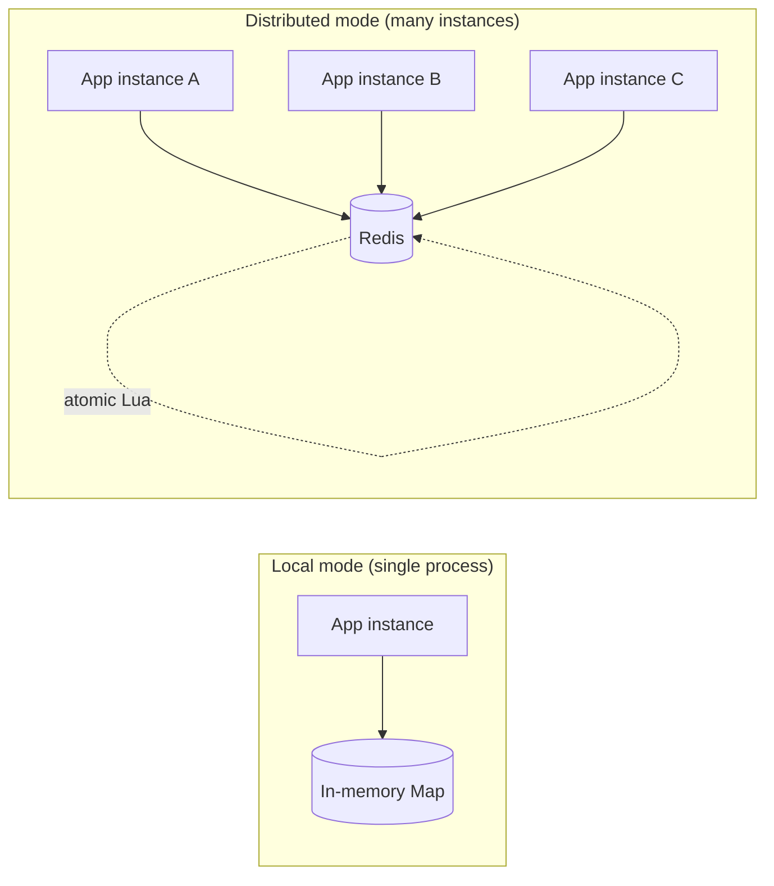

# Governor

> A distributed rate limiter for Node.js — three algorithms, one interface, atomic across many servers.

[](https://www.npmjs.com/package/@chatbot-1/governor)
[](https://github.com/chatbot-1/governor/actions/workflows/ci.yml)
[](./LICENSE)

Governor caps how fast a client can hit your API. It ships **three rate-limiting algorithms** — token bucket, sliding window log, and sliding window counter — behind a single interface, and runs in two modes: **local** (in-memory, single process) or **distributed** (Redis-backed, shared across every instance). The distributed mode does its counting inside an **atomic Lua script**, so concurrent requests across many servers can't overcount.

---

## Why it exists

Rate limiting is easy to get *approximately* right and surprisingly hard to get *exactly* right — especially once you run more than one server. Governor is built to demonstrate the two things that actually matter in a distributed setting:

1. **Algorithm choice is a tradeoff** between memory, accuracy, and burst behavior. There is no single "best" one.
2. **Correctness under concurrency** requires atomic operations. A naive read-then-write silently leaks past the limit under load (this repo proves it with a test).

## Install

```bash
npm install @chatbot-1/governor
# distributed mode also needs a Redis client:
npm install ioredis
```

## Quick start

Every limiter implements the same interface, so they're interchangeable:

```ts
interface RateLimiter {
  isAllowed(key: string): Promise<{ allowed: boolean; remaining: number; resetAt: number }>;
}
```

**Local (single process):**

```ts
import { TokenBucket } from '@chatbot-1/governor';

const limiter = new TokenBucket({ limit: 100, windowMs: 60_000 }); // 100 req / minute

const { allowed, remaining, resetAt } = await limiter.isAllowed('user-42');
if (!allowed) {
  // reject with HTTP 429
}
```

**Distributed (shared across every instance via Redis):**

```ts
import Redis from 'ioredis';
import { RedisTokenBucket } from '@chatbot-1/governor';

const redis = new Redis(process.env.REDIS_URL);
const limiter = new RedisTokenBucket({ redis, limit: 100, windowMs: 60_000 });

await limiter.isAllowed('user-42'); // same call, now shared and race-safe
```

Switching algorithm or mode is a one-line change — `new TokenBucket(...)` → `new RedisSlidingWindowCounter(...)` — because they all satisfy the same `RateLimiter` interface.

## Express middleware

```ts
import express from 'express';
import Redis from 'ioredis';
import { RedisTokenBucket, expressRateLimit } from '@chatbot-1/governor';

const app = express();
const limiter = new RedisTokenBucket({ redis: new Redis(), limit: 100, windowMs: 60_000 });

app.use(expressRateLimit(limiter)); // sets X-RateLimit-* headers, 429 + Retry-After when blocked
```

A runnable version lives in [`examples/express`](./examples/express/server.ts) — `npm run example`.

---

## The three algorithms

| Algorithm | Stores per key | Accuracy | Bursts | Memory | Reach for it when… |
|---|---|---|---|---|---|
| **Token Bucket** | 2 numbers (tokens, timestamp) | Good | ✅ Allows bursts up to bucket size | Tiny | You want burst-friendly UX (public APIs). Used by AWS, Stripe. |
| **Sliding Window Log** | One timestamp per request | Perfect | ❌ Hard ceiling | Heavy (grows with traffic) | You need exact enforcement and volume is modest. |
| **Sliding Window Counter** | 2 numbers (this window, last window) | Very good (approximation) | Smoothed | Tiny | You need accuracy *and* low memory at scale. Used by Cloudflare. |

**Token Bucket** — a bucket holds up to `limit` tokens and refills at a steady rate. Each request spends one; an empty bucket blocks. An idle bucket is full, so a client can burst then gets throttled to the refill rate.

**Sliding Window Log** — keeps the exact timestamp of every request and counts how many fall inside the last `windowMs`. Perfectly accurate because the window truly follows "now", but memory grows with the number of in-window requests.

**Sliding Window Counter** — keeps only the current and previous fixed-window counts and estimates the rolling count by fading the previous window out as the current one progresses (`estimate = current + previous × weight`). Almost as accurate as the log, at a fraction of the memory, with no exploitable fixed-window boundary.

---

## Architecture: local vs distributed



- **Local mode** keeps counts in a process-local `Map`. Fast and dependency-free, but each instance limits independently — three instances with a "100/min" limit would let 300/min through.
- **Distributed mode** keeps counts in Redis, so all instances share one count. Each check runs a Lua script that Redis executes start-to-finish without interleaving, making read-check-write atomic.

---

## Concurrency: the race condition, proven

A naive limiter reads the count, checks it, then writes it back as **separate** Redis round-trips. Under concurrency, many requests read the same value before any writes — so they all pass. Governor runs the whole decision as one atomic Lua script instead.

The repo includes a side-by-side test ([`tests/integration/naive-race-demo.test.ts`](./tests/integration/naive-race-demo.test.ts)). Same load — **500 concurrent requests across 8 connections, limit of 100:**

| Implementation | Requests allowed | Correct? |
|---|---|---|
| Naive get-then-set | **500 / 500** | ❌ leaks 5× past the limit |
| Governor (atomic Lua) | **100 / 500** | ✅ exactly the limit |

```bash
npm run test:redis   # runs the concurrency + correctness suite against a live Redis
```

---

## Benchmarks

Local mode, single thread, Node v22, 10,000 unique keys. Reproduce with `npm run bench`.

| Algorithm | Throughput | Memory (10K keys × 100 req) | Allowed/window (target 100) |
|---|---|---|---|
| **Token Bucket** | ~1.97M ops/sec | **1.4 MB** | 109.9 |
| **Sliding Window Log** | ~1.68M ops/sec | **11.9 MB** | 100.0 |
| **Sliding Window Counter** | ~1.75M ops/sec | **1.2 MB** | 100.0 |

Reading the numbers:

- **Memory is the headline.** The log costs ~**10×** the counter (11.9 MB vs 1.2 MB) for the *same* accuracy, because it stores a timestamp per request while the counter stores two integers. This is the whole reason the counter exists.
- **Token bucket's 109.9** isn't inaccuracy — it's the burst allowance. Under saturation it permits the steady rate *plus* a bucket's worth of initial burst, which is exactly what makes it feel responsive to real clients.
- **Throughput is similar** across all three (~2M evaluations/sec) in local mode; the differentiator is memory and burst behavior, not speed. (Distributed mode throughput is bounded by Redis network latency, not the algorithm.)

---

## Design decisions

**One interface for everything.** Local and distributed, all three algorithms — every limiter is just `isAllowed(key) → { allowed, remaining, resetAt }`. Callers swap implementations without touching their code, and the Express middleware works with any of them.

**Atomicity via Lua, not MULTI/EXEC.** The limit decision depends on the current stored value (*"refill, then check, then decrement"*). `MULTI/EXEC` batches commands but can't branch on a value mid-transaction; a Lua script runs the whole read-decide-write atomically inside Redis. That's the right tool for read-modify-write logic and it avoids the get-then-set race entirely.

**TTLs on every key.** Redis keys expire after the window (`PEXPIRE`), so idle clients don't accumulate — the answer to "what about millions of keys?" is bounded memory via automatic expiry.

**Injectable clock.** Every limiter accepts `now: () => number`. Tests advance a fake clock instead of sleeping, so time-dependent behavior (refills, window rollovers, expiry) is deterministic and instant.

**Fail-open middleware.** If Redis is unreachable, the Express middleware allows traffic through by default rather than taking down the API it protects (configurable via `failOpen`).

**Approximation is a feature, honestly labeled.** The sliding window counter assumes requests in the previous window were evenly spread. That can skew slightly if traffic was bunched, but the memory savings are large and the error is small and bounded — a deliberate, documented tradeoff.

---

## API

All local limiters take `{ limit, windowMs, now? }`. All Redis limiters take `{ redis, limit, windowMs, keyPrefix?, now? }`.

| Local | Distributed (Redis) |
|---|---|
| `TokenBucket` | `RedisTokenBucket` |
| `SlidingWindowLog` | `RedisSlidingWindowLog` |
| `SlidingWindowCounter` | `RedisSlidingWindowCounter` |

Plus `expressRateLimit(limiter, options?)` for Express/Connect.

## Testing

```bash
npm test        # unit tests (all algorithms, local mode) — no Redis needed
npm run test:redis   # integration + concurrency tests — needs a Redis at REDIS_URL (default 127.0.0.1:6379)
npm run bench   # throughput / memory / accuracy benchmarks
```

## License

MIT
